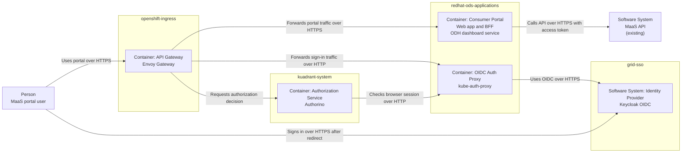

# C4 Level 2: Container diagram

This diagram shows the main applications and services, grouped by namespace. It omits route and policy details.

```mermaid
flowchart LR
  user["Person<br/>MaaS portal user"]
  api["Software System<br/>MaaS API<br/>(existing)"]

  subgraph ns_ingress["openshift-ingress"]
    gateway["Container: API Gateway<br/>Envoy Gateway"]
  end

  subgraph ns_apps["redhat-ods-applications"]
    portal["Container: Consumer Portal<br/>Web app and BFF<br/>ODH dashboard service"]
    auth_proxy["Container: OIDC Auth Proxy<br/>kube-auth-proxy"]
  end

  subgraph ns_kuadrant["kuadrant-system"]
    authorino["Container: Authorization Service<br/>Authorino"]
  end

  subgraph ns_sso["grid-sso"]
    keycloak["Software System: Identity Provider<br/>Keycloak OIDC"]
  end

  user -->|"Uses portal over HTTPS"| gateway
  gateway -->|"Forwards portal traffic over HTTPS"| portal
  gateway -->|"Forwards sign-in traffic over HTTP"| auth_proxy
  gateway -->|"Requests authorization decision"| authorino
  authorino -->|"Checks browser session over HTTP"| auth_proxy
  auth_proxy -->|"Uses OIDC over HTTPS"| keycloak
  user -->|"Signs in over HTTPS after redirect"| keycloak
  portal -->|"Calls API over HTTPS with access token"| api
```
