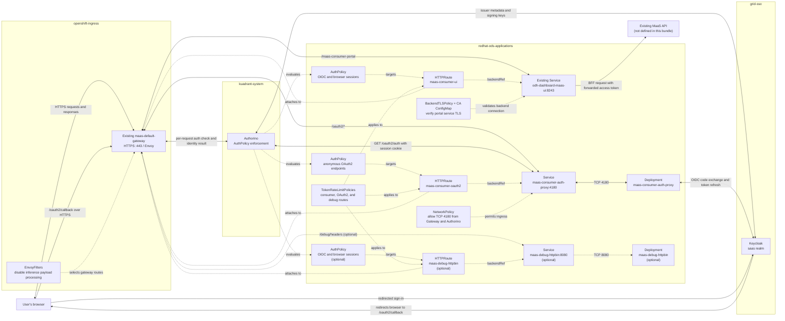

# Detailed deployment communication flow

This chart shows request paths and policy links. The dashed debug path comes from the optional `debug-httpbin` Kustomization.

```mermaid
flowchart LR
  browser["User's browser"]
  api["Existing MaaS API<br/>(not defined in this bundle)"]

  subgraph ns_grid_sso["grid-sso"]
    keycloak["Keycloak<br/>saas realm"]
  end

  subgraph ns_kuadrant["kuadrant-system"]
    authorino["Authorino<br/>AuthPolicy enforcement"]
  end

  subgraph ns_ingress["openshift-ingress"]
    gateway["Existing maas-default-gateway<br/>HTTPS :443 / Envoy"]
    payload_filter["EnvoyFilters<br/>disable inference payload processing"]
  end

  subgraph ns_apps["redhat-ods-applications"]
    ui_route["HTTPRoute<br/>maas-consumer-ui"]
    oauth_route["HTTPRoute<br/>maas-consumer-oauth2"]
    debug_route["HTTPRoute<br/>maas-debug-httpbin<br/>(optional)"]

    ui_auth["AuthPolicy<br/>OIDC and browser sessions"]
    oauth_auth["AuthPolicy<br/>anonymous OAuth2 endpoints"]
    debug_auth["AuthPolicy<br/>OIDC and browser sessions<br/>(optional)"]

    token_limits["TokenRateLimitPolicies<br/>consumer, OAuth2, and debug routes"]
    network_policy["NetworkPolicy<br/>allow TCP 4180 from Gateway and Authorino"]

    proxy_service["Service<br/>maas-consumer-auth-proxy:4180"]
    proxy_pod["Deployment<br/>maas-consumer-auth-proxy"]

    portal_service["Existing Service<br/>odh-dashboard-maas-ui:8243"]
    backend_tls["BackendTLSPolicy + CA ConfigMap<br/>verify portal service TLS"]

    debug_service["Service<br/>maas-debug-httpbin:8080<br/>(optional)"]
    debug_pod["Deployment<br/>maas-debug-httpbin<br/>(optional)"]
  end

  browser <-->|HTTPS requests and responses| gateway
  gateway <-->|"/maas-consumer-portal"| portal_service
  gateway <-->|"/oauth2/*"| proxy_service
  gateway -.->|"/debug/headers (optional)"| debug_service

  gateway <-->|"per-request auth check and identity result"| authorino
  authorino <-->|"GET /oauth2/auth with session cookie"| proxy_service
  authorino <-->|"issuer metadata and signing keys"| keycloak
  proxy_service <-->|"TCP 4180"| proxy_pod
  proxy_pod <-->|"OIDC code exchange and token refresh"| keycloak

  browser -->|"redirected sign-in"| keycloak
  keycloak -->|"redirects browser to /oauth2/callback"| browser
  browser -->|"/oauth2/callback over HTTPS"| gateway

  portal_service -->|"BFF request with forwarded access token"| api
  debug_service -.->|"TCP 8080"| debug_pod

  ui_route -.->|"attaches to"| gateway
  oauth_route -.->|"attaches to"| gateway
  debug_route -.->|"attaches to"| gateway

  ui_route -.->|"backendRef"| portal_service
  oauth_route -.->|"backendRef"| proxy_service
  debug_route -.->|"backendRef"| debug_service

  ui_auth -.->|"targets"| ui_route
  oauth_auth -.->|"targets"| oauth_route
  debug_auth -.->|"targets"| debug_route
  authorino -.->|"evaluates"| ui_auth
  authorino -.->|"evaluates"| oauth_auth
  authorino -.->|"evaluates"| debug_auth

  token_limits -.->|"applies to"| ui_route
  token_limits -.->|"applies to"| oauth_route
  token_limits -.->|"applies to"| debug_route
  backend_tls -.->|"validates backend connection"| portal_service
  network_policy -.->|"permits ingress"| proxy_service
  payload_filter -.->|"selects gateway routes"| gateway
```
