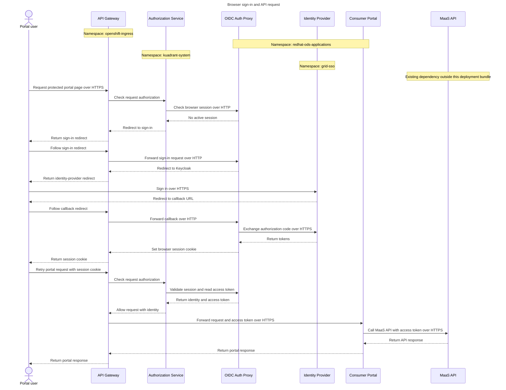

# C4 Level 2 sequence: Portal sign-in and API request

This sequence shows how the high-level containers handle browser sign-in and a portal API request.

```mermaid
sequenceDiagram
  title Browser sign-in and API request
  actor User as Portal user
  participant Gateway as API Gateway
  participant Authorino as Authorization Service
  participant Proxy as OIDC Auth Proxy
  participant Keycloak as Identity Provider
  participant Portal as Consumer Portal
  participant API as MaaS API

  Note over Gateway: Namespace: openshift-ingress
  Note over Portal,Proxy: Namespace: redhat-ods-applications
  Note over Authorino: Namespace: kuadrant-system
  Note over Keycloak: Namespace: grid-sso
  Note over API: Existing dependency outside this deployment bundle

  User->>Gateway: Request protected portal page over HTTPS
  Gateway->>Authorino: Check request authorization
  Authorino->>Proxy: Check browser session over HTTP
  Proxy-->>Authorino: No active session
  Authorino-->>Gateway: Redirect to sign-in
  Gateway-->>User: Return sign-in redirect

  User->>Gateway: Follow sign-in redirect
  Gateway->>Proxy: Forward sign-in request over HTTP
  Proxy-->>Gateway: Redirect to Keycloak
  Gateway-->>User: Return identity-provider redirect

  User->>Keycloak: Sign in over HTTPS
  Keycloak-->>User: Redirect to callback URL
  User->>Gateway: Follow callback redirect
  Gateway->>Proxy: Forward callback over HTTP
  Proxy->>Keycloak: Exchange authorization code over HTTPS
  Keycloak-->>Proxy: Return tokens
  Proxy-->>Gateway: Set browser session cookie
  Gateway-->>User: Return session cookie

  User->>Gateway: Retry portal request with session cookie
  Gateway->>Authorino: Check request authorization
  Authorino->>Proxy: Validate session and read access token
  Proxy-->>Authorino: Return identity and access token
  Authorino-->>Gateway: Allow request with identity
  Gateway->>Portal: Forward request and access token over HTTPS
  Portal->>API: Call MaaS API with access token over HTTPS
  API-->>Portal: Return API response
  Portal-->>Gateway: Return portal response
  Gateway-->>User: Return portal response
```
